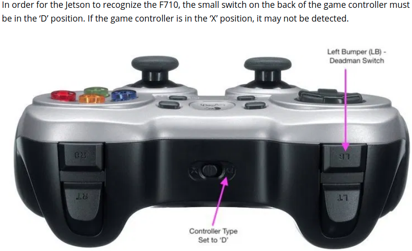

## A Collection of ROS Sensor Drivers for Projects 

### ROS version: Kinetic (Ubuntu 16.04)

#### Logitech F710 Joystick

[REFERENCE](https://www.jetsonhacks.com/2018/08/19/racecar-j-ros-teleoperation/)  

$ sudo apt-get install joystick  
$ sudo apt-get install libusb-dev  
$ sudo apt-get install libspnav-dev  
$ sudo apt-get install libbluetooth-dev  

$ sudo chmod a+rw /dev/input/js0  
$ sudo jstest /dev/input/js0  

$ rosrun joy joy_node  
$ roslaunch teleop_twist_joy teleop.launch  

  
  
  
  
  
#### HLS LFCD LDS 2D Laser

[HLS LFCD LDS 2D LASER DRIVER](https://github.com/ROBOTIS-GIT/hls_lfcd_lds_driver/tree/kinetic-devel)  

$ source devel/setup.bash  
$ roslaunch hls_lfcd_lds_driver hlds_laser.launch  
  
#### Camera Calibration

$ roslaunch usb_cam usb_cam.launch  

$ rosrun camera_calibration cameracalibrator.py --size 8x6 --square 0.025 image:=/usb_cam/image_raw camera:=/usb_cam --no-service-check  

$ rosrun camera_calibration_parsers convert head_camera.yaml head_camera.ini  

#### Intel RealSense R200 Stereo Camera

$ sudo apt-get install linux-headers-generic  
$ sudo apt-get install ros-kinetic-librealsense  
  
$ roslaunch realsense_camera r200_nodelet_rgbd.launch  
$ rqt_image_view  
  
#### ZED Stereo Camera

[ZED ROS WRAPPER](https://github.com/stereolabs/zed-ros-wrapper)  

$ source devel/setup.bash  
$ roslaunch zed_wrapper zed.launch  

$ source devel/setup.bash  
$ roslaunch zed_display_rviz display_zed.launch    

#### TI mmWave Radar AWR1843BOOST

$ source devel/setup.bash  
$ roslaunch ti_mmwave_rospkg rviz_1843_2d.launch  

$ source devel/setup.bash  
$ roslaunch ti_mmwave_rospkg rviz_1843_3d.launch    

